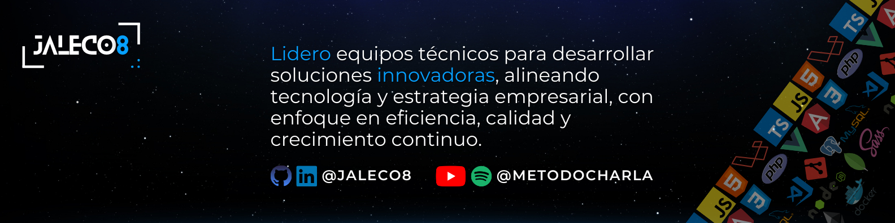

<h1 align="center">Hola 👋, soy Jesús León</h1>
<h2 align="center">👨🏻‍🎓Ing. Computación |🧑🏻‍💻 Tech Lead | 🗂️ Scrum | Product Manager | Product Owner | Project Manager |🎙Podcast Host | US, Europe & Latam 🌎</h2>

   

¡Hola! Soy Jesús León, un líder en tecnología con más de 17 años de experiencia en desarrollo de software y gestión de proyectos técnicos. Mi pasión es guiar equipos hacia la entrega de soluciones innovadoras, utilizando tecnologías tanto de frontend como backend, incluyendo JavaScript, Angular, Vue.js, Express.js, NodeJs, PHP, Laravel y MySQL.

- 📝 Escribo regularmente artículos sobre [https://www.linkedin.com/in/jaleco8/recent-activity/all/](https://www.linkedin.com/in/jaleco8/recent-activity/all/)

- 💬 Pregúntame **php, vue, angular, html, css, javascript, node, laravel, scrum**

- 📄 Conocer mis experiencias [https://www.linkedin.com/in/jaleco8/details/experience/](https://www.linkedin.com/in/jaleco8/details/experience/)

