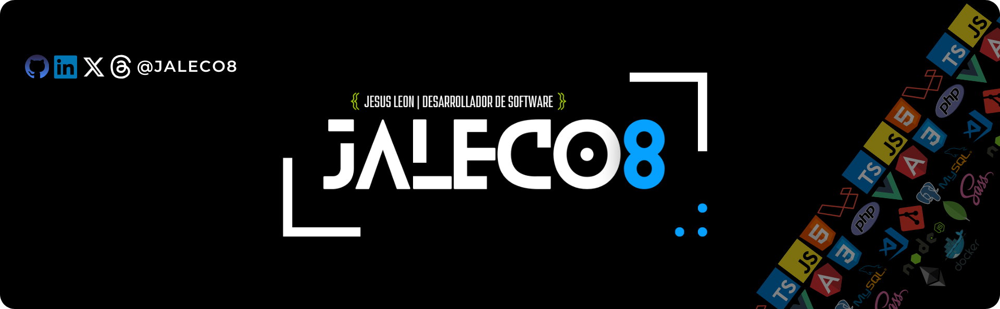

<h1 align="center">Hola 👋, soy Jesús León</h1>
<h2 align="center">👨🏻‍🎓Ing. Computación |🧑🏻‍💻 Desarrollador Senior | Full Stack | PHP JavaScript | 🇻🇪🌎</h2>

   

Ingeniero y Master en Ciencias de la Computación, Especialista en Desarrollo con más de quince (15) años de experiencia en el área de Sistemas Web. Trabajando a vanguardia de la tecnología actual en desarrollo. Cuento con habilidades para trabajar en equipos multidisciplinarios, con capacidad de liderazgo y manejo de metodologías ágiles.
Me especializo en Frontend, pero tengo amplio conocimiento como Full Stack

- 🔭 Actualmente estoy trabajando en [MedCloud Depot](https://medclouddepot.com/)

- 🌱 Actualmente estoy aprendiendo **Inteligencia Artificial**

- 🙋🏻‍♂️ Estoy buscando colaborar en el **Desarrollo de aplicaciones**

- 👨‍💻 Todos mis proyectos están disponibles en [https://github.com/jaleco8?tab=repositories](https://github.com/jaleco8?tab=repositories)

- 📝 Escribo regularmente artículos sobre [https://www.linkedin.com/in/jaleco8/recent-activity/all/](https://www.linkedin.com/in/jaleco8/recent-activity/all/)

- 💬 Pregúntame **php, vue, angular, html, css, javascript, laravel**

- 📫 Cómo ponerse en contacto conmigo **ing.jesusleon@gmail.com**

- 📄 Conocer mis experiencias [https://www.linkedin.com/in/jaleco8/details/experience/](https://www.linkedin.com/in/jaleco8/details/experience/)

